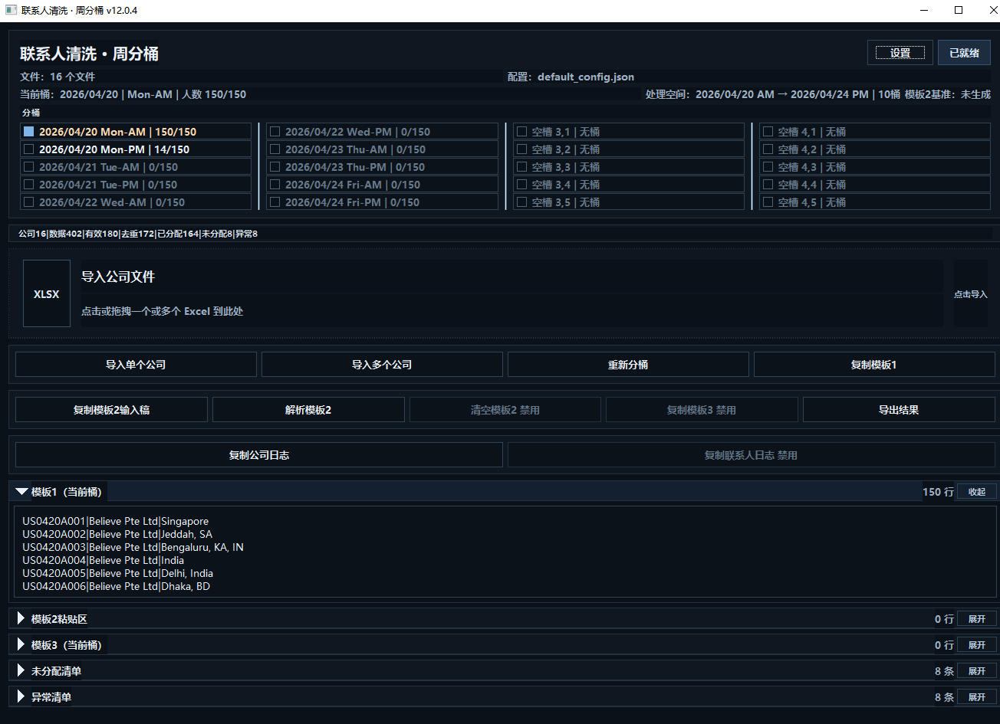
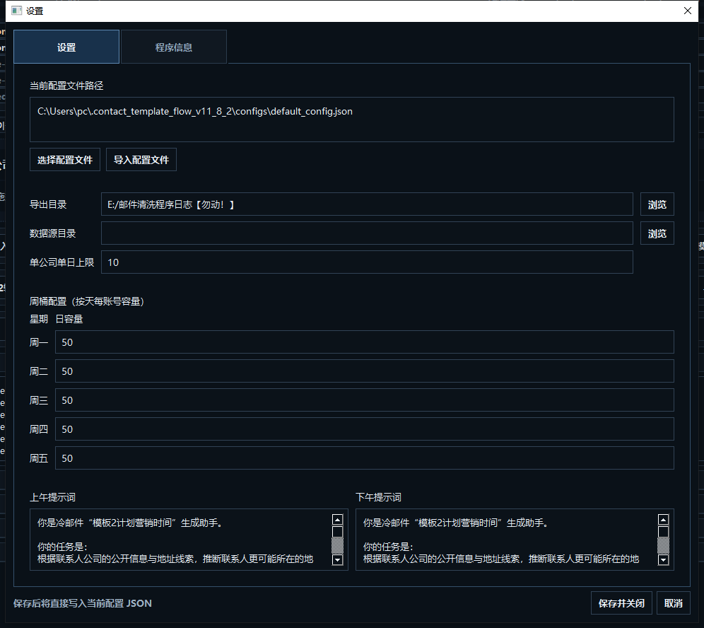

# 联系人清洗 · 周分桶（PySide6 / Excel / RPA 协同）

一个面向冷邮件营销流程的本地桌面工具。  
用于批量读取公司联系人 Excel，完成联系人清洗、去重合并、周分桶排期、模板流转、顺延文件生成、索引维护，以及与 RPA 的稳定协同。

---

## 项目简介

这个项目服务的不是“泛用型 Excel 处理”场景，而是一条 **本地优先、Excel 驱动、RPA 串联** 的联系人营销流程。

它的职责主要包括：

- 批量导入公司联系人文件
- 清洗联系人数据
- 合并去重
- 按周 / AM-PM 桶进行分配
- 生成模板1、模板2输入稿、模板3
- 输出顺延待处理文件
- 维护导出结果与索引文件
- 为后续 RPA / Outlook / CRM 自动化提供稳定输入

项目采用 **PySide6 + openpyxl** 实现桌面端 GUI，重点在于：

- 对人直观可控
- 对 RPA 路径稳定
- 对 Excel 输出结构清晰
- 对批量处理和顺延逻辑可追踪

---

## 核心定位

### 本程序负责

- 联系人清洗
- 单公司 / 多公司批量导入
- 联系人去重与合并
- 周分桶与 AM / PM 分配
- 模板流转（模板1 / 模板2 / 模板3）
- 导出结果包
- 顺延文件生成
- 索引文件维护
- 向 RPA 提供稳定的中间结果

### 本程序不负责

- 正式日志台账长期维护
- CRM 端操作
- Outlook 发信动作
- 最终发信状态回写
- 全流程主调度

这些动作由外部 **RPA** 继续串联。

---

## 功能特性

### 1. 批量联系人清洗
支持批量读取多个公司 Excel 文件，自动识别表头并抽取联系人数据。

支持常见字段：

- 姓名
- 职位
- LinkedIn
- 公司名
- 地址
- 邮箱列
- 邮箱标识列

支持：

- 单文件导入
- 多文件批量导入
- 拖拽 Excel 导入
- 保留来源文件信息

### 2. 合并去重
自动基于以下信息进行联系人合并：

- 邮箱
- LinkedIn
- 姓名 / 职位辅助信息

同时处理：

- 同人多邮箱
- 同邮箱多记录
- B 标识邮箱剔除
- 合并后尽量保留更完整、更长的字段内容

### 3. 周分桶
根据配置进行周维度分桶，支持：

- Mon ~ Fri
- AM / PM 双时段
- 每桶容量控制
- 单公司单日上限控制
- 固定桶槽位
- 当前桶可视化选择

### 4. 模板流转
支持完整模板链路：

- **模板1**：当前桶联系人基础信息
- **模板2输入稿**：供 AI 生成计划营销时间
- **模板2结果解析**
- **模板3**：最终发送内容

并包含：

- 模板2格式校验
- row_id 校验
- 时间合法性校验
- 超范围与异常结果记录

### 5. 顺延处理
对于本批无法入桶的联系人：

- 生成顺延清单
- 复制原始表格并仅保留顺延行
- 尽量保留原表结构与样式
- 记录最早可再次处理时间

### 6. 索引机制
程序会在导出目录维护索引文件：

- `【勿删】处理索引.json`
- `【勿删】处理索引.xlsx`

用于：

- 检测文件是否已处理
- 记录导出时状态 / 最终状态
- 记录顺延人数
- 记录顺延文件路径
- 记录下次最早可处理时间
- 记录对应结果包路径

### 7. 日志输出
支持直接复制：

- **公司日志**
- **联系人日志**

输出为制表符分列文本，可直接粘贴进 Excel。

联系人日志中可继续承接：

- 公司编码
- 联系人 ID
- 批次标签
- 计划时间
- 模板3内容
- 营销账号标识

### 8. 营销账号分配
当前版本已内置营销账号分配逻辑，可输出固定账号标识，例如：

- Export
- Calvin
- Contact
- JohnWu
- sales
- GavinZhao

适合后续：

- 按账号拆分
- 按账号筛选
- 按账号导出
- 交给 RPA 分账号执行

---

## 项目工作流

### 第一步：导入公司文件
用户可通过：

- 点击导入
- 拖拽 Excel 文件

将多个公司联系人表导入程序。

### 第二步：清洗与分桶
程序自动完成：

- 表头识别
- 联系人抽取
- 邮箱清洗
- 去重合并
- 周分桶
- 当前桶展示

### 第三步：复制模板1 / 模板2输入稿
用户复制当前桶内容，交给 AI 生成模板2结果。

### 第四步：粘贴并解析模板2
程序解析 AI 返回结果，生成模板3发送内容。

### 第五步：复制日志 / 导出结果
程序导出：

- 批次总览
- 标准模板1
- 模板2输入稿
- 发送清单
- 顺延清单
- 异常清单

并同步生成：

- 顺延待处理副本
- 索引文件
- 文件归档移动

### 第六步：RPA 接管
RPA 后续负责：

- 读取结果
- 推进 CRM / Outlook / 日志台账
- 回写最终状态与完成时间

---

## 导出结果说明

一个批量结果文件通常包含以下表单：

### 1. 批次总览
字段示例：

- 文件名
- 导出时状态
- 此次入桶数
- 总人数

### 2. 标准模板1
当前批次联系人基础信息表。

### 3. 模板2输入稿
供 AI 使用的最小必要输入稿。

### 4. 发送清单
模板2解析结果与模板3整理后的最终发送表。

### 5. 顺延清单
本批未能入桶的联系人列表。

### 6. 异常清单
解析异常、格式异常、时间异常等问题记录。

---

## 顺延规则

本项目中的顺延不是“下个空桶立即继续”，而是按批量处理模式控制。

当前规则：

- 顺延联系人不会插入本批后续尚未完成的桶
- **最早可再次处理时间 = 本批最后一个桶日期 + 7 天**

这样做是为了避免：

- 同一批次内部串批
- 顺延文件隔天误进入队列
- 用户对顺延时间判断混乱

---

## 与 RPA 的协同原则

这个项目从一开始就是按 **RPA 协同** 思路设计的。

### 稳定原则

- 对外窗口名尽量保持稳定
- 关键 UI 路径与 AutomationId 尽量不随版本漂移
- 外部 RPA 依赖接口不轻易改动

### 冻结接口

以下桶相关定位命名被视为冻结接口，不建议随意修改：

- `bucketColumnsHost`
- `bucketColumn__{x}`
- `bucketPickRadio__{x}_{y}__{state}`
- `bucket_slot_{x}_{y}_{state}`

### 分工原则

程序负责：

- 清洗
- 分桶
- 模板流转
- 导出
- 顺延与索引基础维护

RPA 负责：

- 读取导出结果
- 控制后续流程
- 正式日志回写
- 最终状态维护

---

## 技术栈

- Python 3.x
- PySide6
- openpyxl
- JSON
- Excel（xlsx）

---

## 运行环境

建议环境：

- Windows 10 / 11
- Python 3.10+
- 已安装 PySide6
- 已安装 openpyxl
